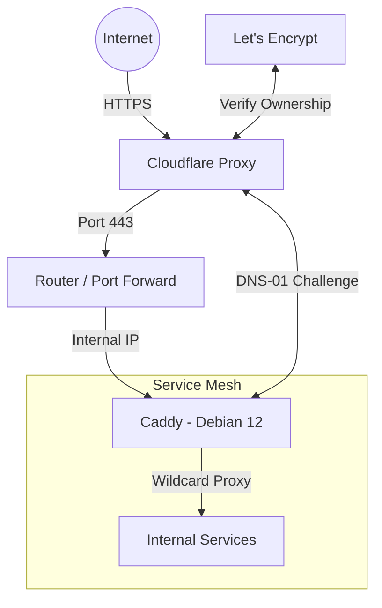

# 🏠 Homelab Infrastructure
Automated deployment and configuration of my personal lab environment. This repository uses IaC to ensure my services are reproducible, secure, and easily recoverable.

## 🚀 Tech Stack
- **Hypervisor:** Proxmox VE
- **Provisioning:** Terraform
- **Configuration:** Ansible
- **Reverse Proxy:** Caddy (Custom build with Cloudflare DNS-01)
- **OS:** Debian 12 (Bookworm)

## 🛠️ Key Features
Wildcard SSL: Automatic certs for *.domain.com using the Caddy-Cloudflare DNS module.
Declarative Config: Every Caddy route and system dependency is managed via Ansible.
Secrets Management: Sensitive tokens are kept in secrets.yml (git-ignored) or encrypted via Ansible Vault.

- **Automated SSL:** Wildcard certificates managed via Caddy's Cloudflare module, zero manual renewal.
- **Immutable Configs:** Caddy and system services are managed via Ansible playbooks.
- **Wildcard Routing:** All subdomains automatically route to the internal service mesh.

## 🏗 Network Architecture

