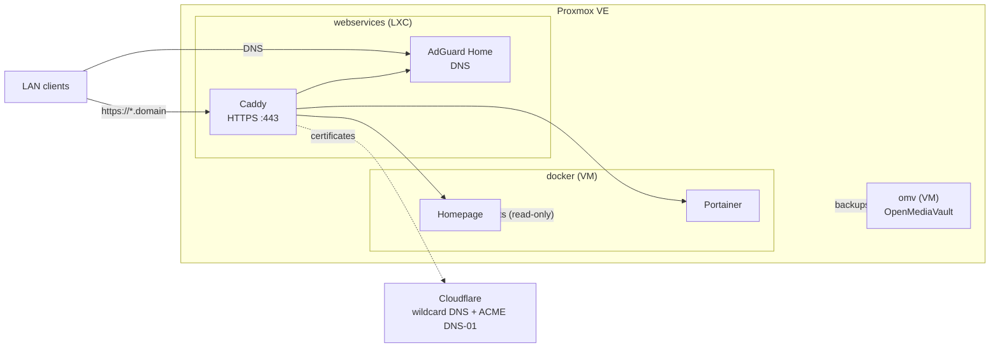

# 🏠 Homelab Infrastructure

Infrastructure as code for a single-node Proxmox VE homelab. Terraform creates the guests, Ansible configures them, and Caddy publishes the services over HTTPS.

The goal: **from a clean Proxmox install, this repo rebuilds the whole lab**, and every run is **idempotent**: running it again with no config change changes nothing.

## 🚀 Tech stack

| Layer | Tool |
|---|---|
| Hypervisor | Proxmox VE |
| Provisioning | Terraform with the [`bpg/proxmox`](https://registry.terraform.io/providers/bpg/proxmox/latest) provider |
| Configuration | Ansible (`community.general`, `community.docker`) |
| Reverse proxy / TLS | Caddy, custom build with the Cloudflare DNS module (Let's Encrypt via DNS-01) |
| DNS / ad blocking | AdGuard Home |
| NAS | OpenMediaVault |
| Containers | Docker CE, Portainer, Homepage dashboard |
| Guest OS | Debian 12 (LXC), Debian 13 cloud images (VMs) |

## 🧱 What it deploys

| Guest | Type | Runs |
|---|---|---|
| **webservices** | Unprivileged LXC | AdGuard Home (LAN DNS + ad blocking), Caddy (reverse proxy for every service) |
| **omv** | VM (cloud-init) | OpenMediaVault with a passed-through data disk; hosts the backup share |
| **docker** | VM (cloud-init) | Docker CE, Portainer, Homepage |

Plus host-level resources: a Proxmox storage backed by the NAS backup share, and a read-only Proxmox user and API token for the dashboard.


```mermaid
flowchart LR
    clients["LAN clients"]
    cf["Cloudflare<br/>wildcard DNS + ACME DNS-01"]

    subgraph pve["Proxmox VE"]
        subgraph ws["webservices (LXC)"]
            adguard["AdGuard Home<br/>DNS"]
            caddy["Caddy<br/>HTTPS :443"]
        end
        omv["omv (VM)<br/>OpenMediaVault"]
        subgraph docker["docker (VM)"]
            portainer["Portainer"]
            homepage["Homepage"]
        end
    end

    clients -- "DNS" --> adguard
    clients -- "https://*.domain" --> caddy
    caddy -. "certificates" .-> cf
    caddy --> portainer
    caddy --> homepage
    caddy --> adguard
    homepage -. "status widgets (read-only)" .-> pve
    pve -- "backups (SMB)" --> omv
```

## 🛠️ Key features

- **Automatic HTTPS:** Caddy obtains and renews a Let's Encrypt certificate per site through Cloudflare's DNS API, with no ports opened to the internet. A wildcard DNS record points every subdomain at Caddy, so a new site needs no DNS change.
- **Ordered, idempotent provisioning:** a single `terraform apply` creates the guests, runs their Ansible playbooks, and deploys the Caddy routes **last**, once every backend exists. The Docker and Caddy playbooks re-run automatically when their files change.
- **Pinned everything:** cloud images (dated build + checksum), Docker CE, container images, AdGuard Home (release + sha256) and Ansible collections are pinned. Upgrading is a version bump in one file.
- **No setup wizards:** AdGuard Home's config and Portainer's admin account exist before first start, so nothing sits exposed waiting for someone to click "set up".
- **Secrets stay out of git:** credentials live in gitignored files (`*.tfvars`, `secrets.yml`, generated `tf_gen.yml`); only `*.example` templates are committed. Generated SSH keys and secret files are written with mode 0600.
- **Least privilege where the services allow it:** SSH-key-only login on the Docker VM, a read-only (`PVEAuditor`) Proxmox token for the dashboard, and the Cloudflare token scoped to DNS edits on one zone.

## 📁 Repository layout

```
terraform/
  main.tf, variables.tf         root module: provider, guests, storage, users, Ansible triggers
  terraform.tfvars.example      template for terraform.tfvars
  modules/
    webservices/                LXC for AdGuard Home + Caddy
    omv/                        OpenMediaVault VM (cloud image + cloud-init, disk passthrough)
    docker/                     Docker host VM (pinned cloud image, vendor-data, SSH key)
ansible/
  requirements.yml              pinned collections
  inventory.ini                 generated by Terraform
  webservices/
    webservices.yml             base: packages, firewall, AdGuard Home, Caddy build
    caddy.yml                   Caddy routes (run last)
    templates/                  Caddyfile, AdGuard config
    vars/                       versions.yml, secrets.yml.example
  docker/
    docker.yml                  Docker CE, Portainer, Homepage
    templates/homepage/         Homepage config (services, widgets, settings)
    vars/                       versions.yml, secrets.yml.example
```

## ✅ Prerequisites

- A Proxmox VE host with the default `local` and `local-lvm` storages and a `vmbr0` bridge
  - `local` must allow the `snippets` and `import` content types (Datacenter → Storage → local)
  - a Debian 12 LXC template in `local` (used by the webservices container)
- A Proxmox API token for Terraform, and an SSH key authorized for `root` on the host (the provider uploads cloud-init snippets over SSH; disk passthrough also needs it)
- A domain on Cloudflare with a wildcard `A` record pointing at the Caddy container, and an API token with **Zone → DNS → Edit** on that zone
- A control machine with Terraform, Ansible and the collections from `ansible/requirements.yml`

## ⚙️ Setup

```bash
# 1. Ansible collections
ansible-galaxy collection install -r ansible/requirements.yml

# 2. Configuration (all gitignored once copied)
cp terraform/terraform.tfvars.example              terraform/terraform.tfvars
cp ansible/webservices/vars/secrets.yml.example    ansible/webservices/vars/secrets.yml
cp ansible/docker/vars/secrets.yml.example         ansible/docker/vars/secrets.yml
chmod 600 terraform/terraform.tfvars ansible/*/vars/secrets.yml
# fill them in; the AdGuard Home config template (ansible/webservices/templates/AdGuardHome.yaml.j2)
# is also gitignored and must be provided

# 3. Plan, review, apply (from terraform/: generated paths are relative to it)
cd terraform
terraform init
terraform plan -out=tfplan
terraform apply tfplan
```

`terraform apply` does, in order:
1. creates the guests and host resources through the Proxmox API
2. writes the Ansible inventory and generated variables (`tf_gen.yml`, 0600)
3. runs the guest playbooks: `docker.yml` whenever its files change, `webservices.yml` when the container is created (re-run it by hand after editing it)
4. runs `caddy.yml` to publish the routes

## 🔁 Day-to-day

| Task | How |
|---|---|
| Add a website behind Caddy | Add a site block to `ansible/webservices/templates/Caddyfile.j2`, then `terraform apply` (the Caddyfile is validated before it goes live) |
| Add a service to the dashboard | Edit `ansible/docker/templates/homepage/services.yaml.j2`, then `terraform apply` |
| Enable a dashboard widget | Add its credentials to `ansible/docker/vars/secrets.yml` (see the example file), then `terraform apply` |
| Upgrade a component | Bump its version (and checksum) in the relevant `vars/versions.yml` or module variable, then plan and apply |

### Checking idempotency

```bash
cd terraform && terraform plan -detailed-exitcode        # exit code 0 = no changes
cd ansible && ansible-playbook -i inventory.ini docker/docker.yml --check   # expect changed=0
```

Always read the plan before applying: a `must be replaced` on a VM or container means data loss.

## 🗺️ Roadmap

- Host bootstrap playbook, so a freshly installed Proxmox needs no manual setup (repositories, storage content types, least-privilege Terraform user, USB mappings)
- Remaining guests (Home Assistant OS, a Windows print-server VM, a dev VM) built from pinned images
- Scheduled backups with an off-site copy (3-2-1), and restore tests
- Secrets encrypted with ansible-vault
- CI: linting and secret scanning on every push, Molecule idempotence tests, nightly drift detection

## 📄 License

[MIT](LICENSE)
